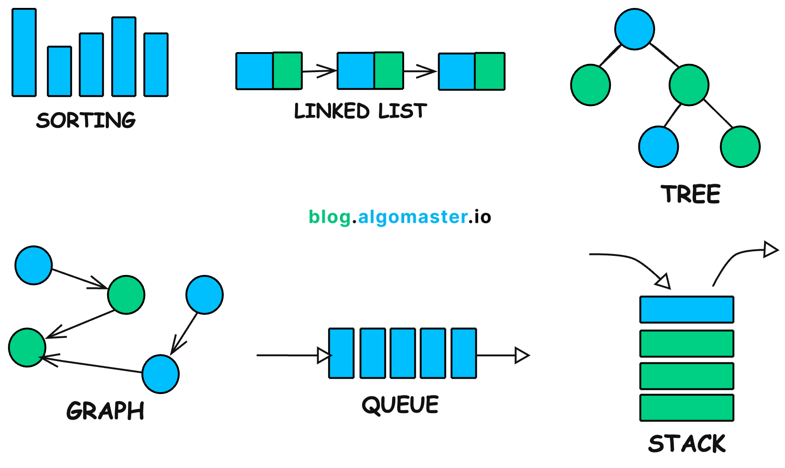

# Algorithms and Data Structures

# Description
Laboratories' exercises for the course of "Algoritmi e Strutture Dati" at Politecnico di Torino, Italy

## Structure of the repository
- Part1: laboratories 1-3 (base C, recursion, file management and sorting)
- Part2: laboratories 4-6 (graphs, lists, backtracking, dynamic programming, ADT)
- Part3: laboratories 7-9 (advanced ADT, graphs and BST)

